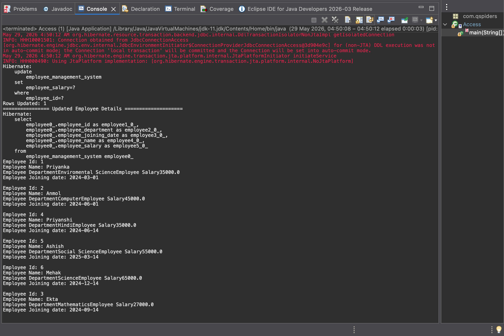
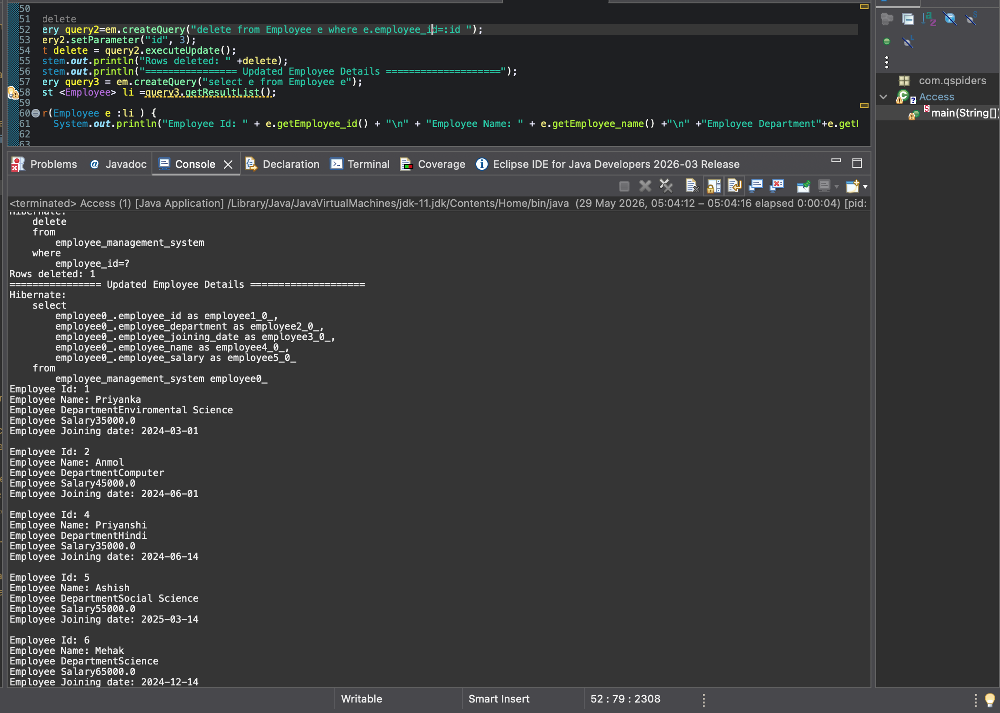

# Employee Management System

## 📌 Project Overview

A Java-based Employee Management System built using JPA (Hibernate) and PostgreSQL. This project demonstrates complete CRUD operations, JPQL queries, and salary-based filtering with a clean and layered architecture.

---

## 🚀 Features

* Add new employees
* View all employees
* Update employee details
* Delete employee records
* Salary-based filtering using JPQL
* Transaction management with JPA

---

## 🛠️ Tech Stack

* Java
* Hibernate (JPA)
* PostgreSQL
* Maven

---

## 📂 Project Structure

```
Employee-Management-System/
 ├── src/
 │   ├── main/
 │   │   ├── java/
 │   │   └── resources/
 ├── pom.xml
 ├── README.md
```

---

## ⚙️ Setup Instructions

1. Clone the repository
2. Configure PostgreSQL database
3. Update `persistence.xml` with DB credentials
4. Run the project

---

## 📊 Key Concepts Used

* Object Relational Mapping (ORM)
* JPQL (Java Persistence Query Language)
* Entity Management
* Transaction Handling

---

## 🎯 Purpose

This project is designed to showcase backend development skills using Java, Hibernate, and database integration, following clean coding practices.

---

## 📸 Project Output Screenshots

### 🗄️ Database Records


## 📸 Screenshots


## 💻 Updated Employee Data (Eclipse)



### ❌ Delete Operation

## 🗑️ After Deleting Employee



## 👨‍💻 Author

Your Name
